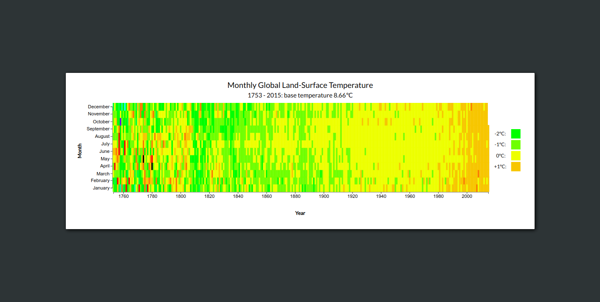

# Heat Map

## Introduction
This heat map shows the monthly difference in global land-surface temperature compared to a base temperature of 8.66℃.  
The data range is from the year 1753 up to 2015.

Heat maps are useful for representing large data sizes and quickly indicate trends.

This heat map is made with [D3](https://d3js.org/).

This project is part of freeCodeCamps Data Visualization certificate.

***

## Project Requirements
* The heat map should have a title with a corresponding id="title".
* The heat map should have a description with a corresponding id="description".
* The heat map should have an x-axis with a corresponding id="x-axis".
* The heat map should have a y-axis with a corresponding id="y-axis".
* The heat map should have rect elements with a class="cell" that represent the data.
* There should be at least 4 different fill colors used for the cells.
* Each cell will have the properties data-month, data-year, data-temp containing their corresponding month, year, and temperature values.
* The data-month, data-year of each cell should be within the range of the data.
* The heat map should have cells that align with the corresponding month on the y-axis.
* The heat map should have cells that align with the corresponding year on the x-axis.
* The heat map should have multiple tick labels on the y-axis with the full month name.
* The heat map should have multiple tick labels on the x-axis with the years between 1754 and 2015.
* The heat map should have a legend with a corresponding id="legend".
* The legend should contain rect elements.
* The rect elements in the legend should use at least 4 different fill colors.
* Moving the mouse over an area shows a tooltip with a corresponding id="tooltip" which displays more information about the area.
* The tooltip should have a data-year property that corresponds to the data-year of the active area.

***

## Project Data
Global temperature:  
https://raw.githubusercontent.com/freeCodeCamp/ProjectReferenceData/master/global-temperature.json

***

## Final Project
https://myrmidonut.github.io/fcc_dataviz_heat_map

***

## Preview Images
### Main Screen:

